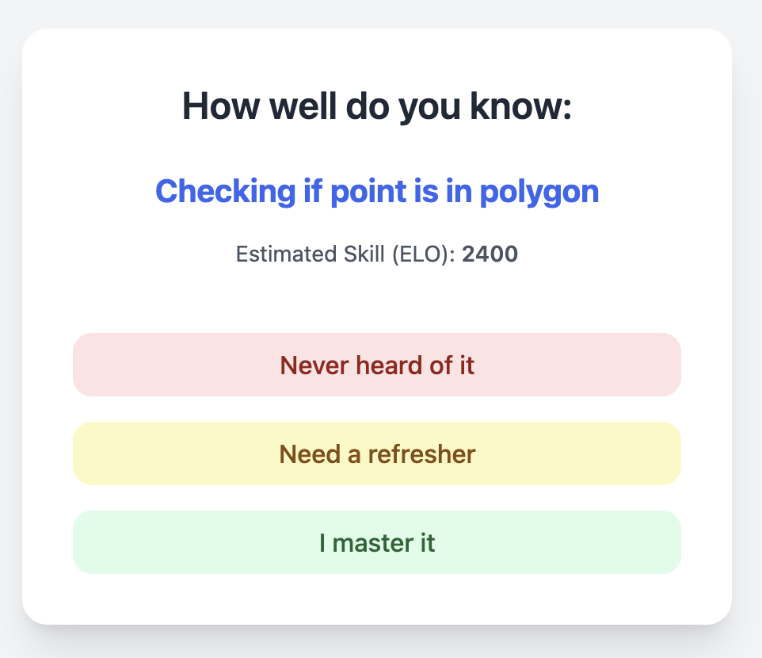
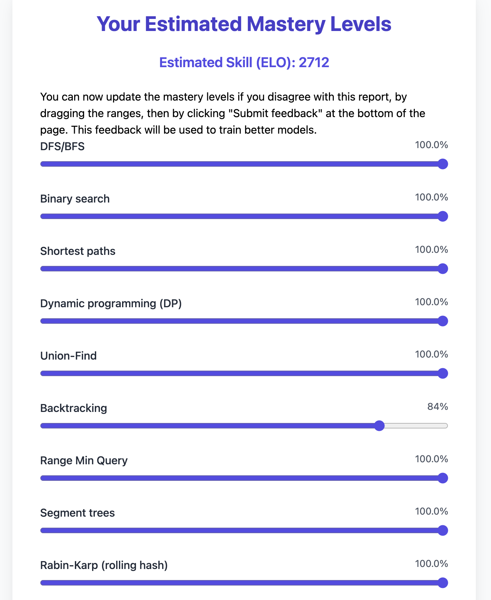

# Minipix

This is a lightweight adaptive test that can be used for self-assessment at the beginning of a class.
Then the professor can make recommendations about ressources to address prerequisites.
The dependencies are low, like flask or scikit-learn (you can also implement your own logistic regression).

Actually, 10 years ago, a similar tool was developed to convince [Pix](https://pix.org/en/) to use adaptive tests in the first version.

To make your life easier, [install uv](https://docs.astral.sh/uv/#highlights).

**Otherwise**, install dependencies, possibly in a virtualenv that you have to load:

    pip install flask numpy scikit-learn python-dotenv

Put a SECRET_KEY in `.env`:

    echo 'SECRET_KEY="<change this>"' >> .env

Initialize the local SQLite database (seeds `topic_info` from `app/topics.csv` if empty):

    python -m app.db

Run the Flask app, if you used uv:

    FLASK_APP=app.app_lr uv run python -m flask run

If you didn't use uv:

    FLASK_APP=app.app_lr python -m flask run

## Examples

## Contributors

- Anav Agrawal
- [Jill-Jênn Vie](https://jjv.ie)
