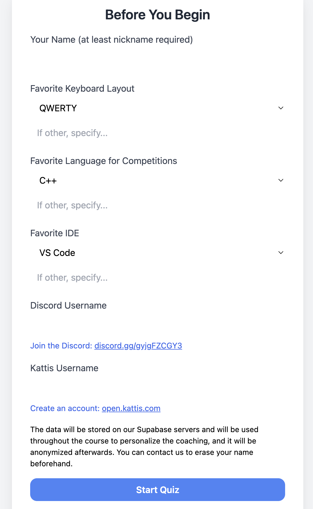

# Minipix

To make your life easier, [install uv](https://docs.astral.sh/uv/#highlights).

**Otherwise**, install dependencies, possibly in a virtualenv that you have to load:

    pip install flask numpy scikit-learn python-dotenv

Put a SECRET_KEY in `.env`:

    echo 'SECRET_KEY="<change this>"' >> .env

Initialize the local SQLite database (seeds `topic_info` from `app/topics.csv` if empty):

    python -m app.db

Run the Flask app :

    FLASK_APP=app.app_lr uv run python -m flask run  # With uv
    FLASK_APP=app.app_lr python -m flask run  # Or without uv

## Examples

